# CHIP MAP: exploring the ATECC608 on the wallet itself

The secure element usually disappears under a product. On this wallet it is the other way round:
press a button and the chip is a place you can walk through, drawn as a floor plan, with rules,
memory, secrets, a random generator and a few one-way doors. This is how that part of the firmware
works: the screens, the keys, the three safety classes, the gates in front of anything permanent,
the ceremonies behind those gates, and the code.

Everything below runs on the Pico 2 W with the Waveshare Pico-LCD-1.3 (240×240, joystick, A/B/X/Y)
and on the emulator (`tools/emu`), whose virtual ATECC608 answers like a fresh Adafruit breakout.

## Two doors: X and B

From the home screen:

- **X** opens the **CHIP MAP**. Everything on the map is a thing that exists on the chip.
- **B** opens **LEARN**, a tutorial of five short chapters. Each chapter is one card of text; A on
  the card takes you to the real screen it talks about. Inside the chip UI, B is "what is this?":
  the card for the screen you are on.

Y always goes up one level, and from the top of the map or the tutorial it goes home.

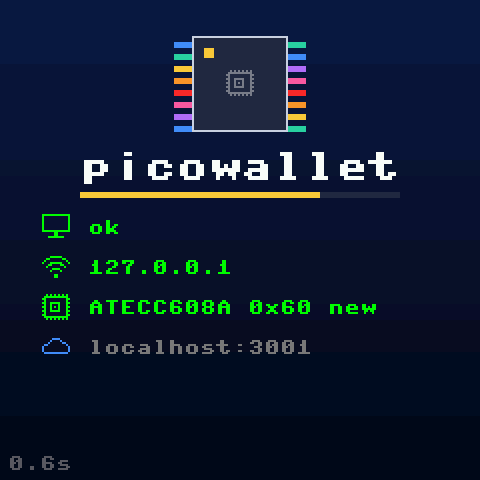
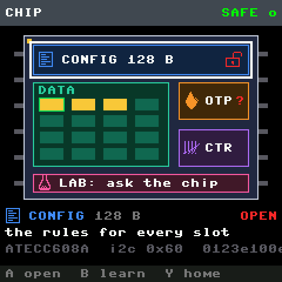

## The header: where you are, and whether the wallet is armed

Every chip screen has the same 22-pixel header bar, tinted with the colour of the zone you are in:
CONFIG blue, DATA teal, OTP orange, COUNTERS purple, LAB pink, LEARN gold, refusals and the red
screen red, results green. On the left is the breadcrumb: `CHIP`, `CHIP > CONFIG`,
`CHIP > DATA > SLOT 3`, `LEARN > 2 ASK THE CHIP`. It is built from the trail of screens you came
through; when it gets long it loses its head, never its tail (`.. DATA > SLOT 0`).

On the right is the wallet's state: `SAFE o` in green, or `! ARMED 57s` in red counting down.
ARM is not on the map on purpose. It is the wallet's own safety catch, not a feature of the chip.

## The map

The map is the die itself: a dark rectangle with legs, and inside it the regions where they sit.
CONFIG is a strip across the top with a padlock showing whether it is open or sealed. DATA is a 4×4
field of small tiles, one per slot, coloured by what the slot is (gold for a P-256 key, blue for a
public key, purple for AES, teal for plain data), the active slot outlined in green. OTP and
COUNTERS are two small blocks on the right; the LAB is docked along the bottom. The joystick moves
the white frame from region to region; the caption under the die names it, gives its size and
state, and one line on what it is for. A opens the region.

```
CHIP  (ATECC608A, i2c 0x60)
├── CONFIG     128 B   OPEN | LOCKED     the rules for every slot
│   ├── o RAW BYTES                       the 128 bytes, 8 a row, slot table in white
│   ├── o COMPARE WITH SAVED              chip vs the saved snapshot
│   ├── ~ WRITE WALLET CONFIG             reversible while the zone is open
│   ├── ~ RESTORE SAVED CONFIG            reversible: the snapshot goes back
│   ├── ! LOCK CONFIG FOREVER             permanent (only once the chip holds the wallet table)
│   ├── ! LOCK DATA ZONE                  permanent (only after the config lock)
│   └── o RE-READ
├── DATA       16 slots                   a 4x4 grid of tiles: 36 B (0-7), 416 B (8), 72 B (9-15)
│   └── SLOT n                            kind, size, its rules, then its actions
│       ├── o USE THIS KEY                make it the signing slot
│       ├── o SHOW PUBLIC KEY             qx and qy; A there shows it as a QR code
│       ├── o SIGN TEST                   sign 32 bytes, verify on the Pico, read counter 0
│       ├── ! NEW KEY                     permanent: GenKey replaces what is there
│       ├── ~ WRITE A NOTE                clear data slots only: 32 bytes you can overwrite
│       ├── o READ THE BYTES              slots the rules let you read
│       └── ! LOCK SLOT FOREVER           permanent
├── OTP        64 B                       write-once bits; hidden until the config lock
├── COUNTERS   2                          only ever go up
└── LAB                                   questions, one real command each
    ├── WHO ARE YOU?                      Info revision + serial
    ├── ARE YOU HEALTHY?                  SelfTest
    ├── MAKE RANDOMNESS                   Random
    ├── PLAY SNAKE                        make randomness yourself: the apples come from a hash of
    │                                     your presses; the report counts the bits (snakelab.py)
    ├── HASH SOMETHING                    SHA-256 of "picowallet", compared with the Pico's
    ├── IS YOUR SLOT A KEY?               Info KeyValid on the active slot
    ├── WHAT'S COUNTER 0?                 Counter read
    ├── WHAT'S IN YOUR OTP?               Read OTP block 0
    ├── TRY READING SECRET SLOT 8         Read data slot 8 (a secret slot under the wallet config)
    └── READ YOUR OWN ADDRESS             Read config word 4 (the I2C address byte)

LEARN
├── 1 WHAT'S INSIDE?        -> the map
├── 2 ASK THE CHIP          -> the LAB
├── 3 CHANGE THE RULES      -> the CONFIG page
├── 4 MAKE A KEY            -> the DATA grid (waits for sealed rules)
├── 5 SEAL THE VAULT        -> the CONFIG page (the three one-way doors)
└── ? COLOURS AND GATES
```

Keys on every menu: joystick up/down moves, A (or the joystick press) opens or does, Y goes up.
On the DATA grid the joystick moves in all four directions; on a slot page, left/right step to the
neighbouring slots. Result screens dismiss with A.

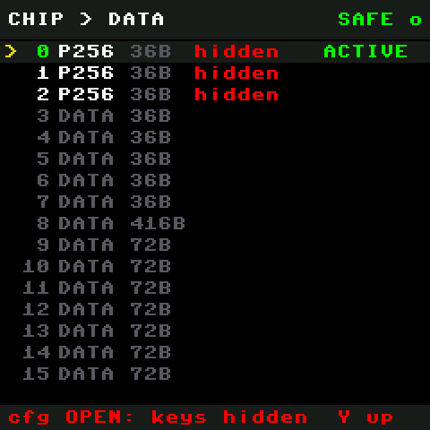
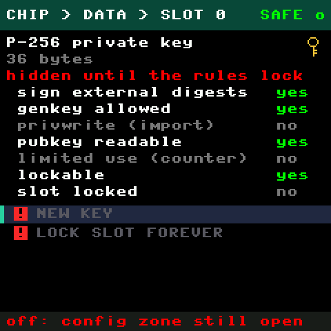

Each tile shows the slot number, its kind as an icon, its size, and one word: a fingerprint once a
key is there, `hidden` in red while the config zone is still open, `empty` for a key slot with no
key yet, `secret` or `clear` for data slots (the rules decide whether the chip will ever hand the
bytes out in clear). A green bar marks the active slot, a red padlock a locked one.

## Three classes, said three ways

Every action is one of three kinds, and each is shown by a coloured badge with its glyph, and by
words in the footer when the item is selected, so it is never colour alone:

| badge | words | examples |
|---|---|---|
| green `o` | `SAFE TO EXPLORE: no changes` | reads, the LAB, RAW BYTES, SHOW PUBLIC KEY, SIGN TEST |
| yellow `~` | `REVERSIBLE: can be restored` | WRITE WALLET CONFIG, RESTORE SAVED CONFIG, WRITE A NOTE |
| red `!` | `PERMANENT: cannot be undone` | the three locks, NEW KEY |

An item that cannot run right now is dimmed and the footer says why: `off: config zone still
open`, `off: ALLOW_LOCK is False on the board`, `off: not armed: hold B+Y 3 s`, `off: write the
wallet config first`.

### The gates in front of red

A permanent action goes through three gates, in this order:

1. **The flag on the board.** `ALLOW_LOCK` or `ALLOW_GENKEY` must be `True` in `secrets.py` on the
   Pico. Shipped default: both `False`. This needs a laptop and a push.
2. **ARM.** Hold **B and Y together for 3 seconds** on any chip screen. A bar fills along the
   bottom; when it completes the header turns `! ARMED 60s` and counts down. Holding B+Y again
   disarms. This lives in `signer.py`, so the app's remote `genkey` and `lock-config` commands
   over WiFi need it too: nothing permanent happens without someone at the device.
3. **The red screen.** `PERMANENT: cannot be undone`, an open padlock, exactly what is about to be
   sealed, and A held for **3 seconds** with a bar and a 3-2-1 countdown. Y cancels.

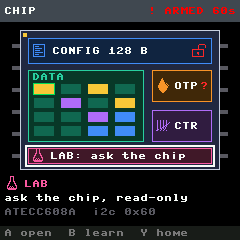
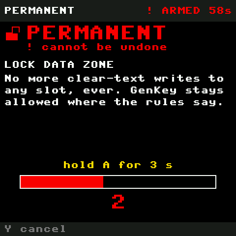

### The ceremonies

What happens after the hold is not a menu line. The chip does the permanent thing, and then:

- **RULES SEALED** (LOCK CONFIG FOREVER): the die is drawn with the CONFIG strip pulsing red, the
  screen flashes white once, the strip turns green, the padlock closes, `RULES SEALED`, "never to
  change again". Then the green SEALED screen with what opens next (the data zone, NEW KEY).
- **KEY CREATED** (NEW KEY): the slot's tile fills with noise from the chip's own random generator
  that thins out over eight frames while the key icon and the new fingerprint settle in.
- **KEY SEALED** and **DATA SEALED** (LOCK SLOT, LOCK DATA ZONE): the padlock closes.

Each is under a second, drawn on the wallet's timer right after the chip answers.

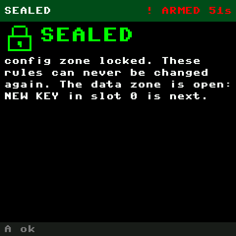
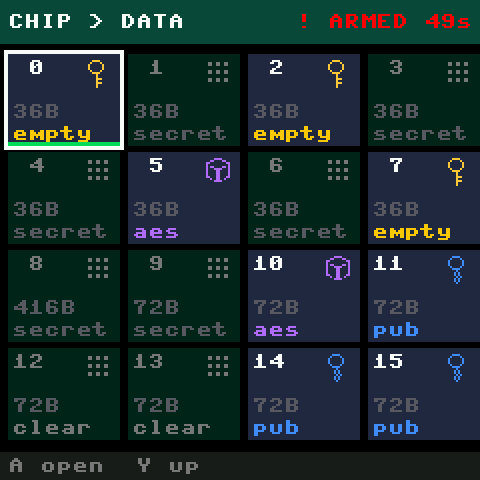

The yellow screen is the lighter version: what will change, `I2C address unchanged`, `config zone
stays OPEN`, and A held for 1.5 s. Y shows the full diff; B cancels.

## Refusals are part of the lesson

A fresh chip says no to a lot: it hides the DATA and OTP zones, refuses GenKey and Sign, and
answers Random with a fixed test pattern until its config zone is locked. A sealed chip still says
no where its rules say so: slot 8 under the wallet config is secret, and the chip never hands its
bytes out in clear. The UI treats each refusal as an answer. The screen says `CHIP SAYS: NOT
ALLOWED`, then **Why?** in plain words for this chip state, then the raw truth: `STATUS 0x0F`,
`execution error: not allowed in this state`. A on that screen shows the exact command: opcode,
parameters, data, the answer bytes, round trip.

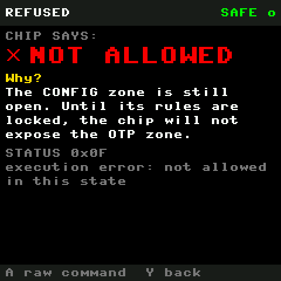
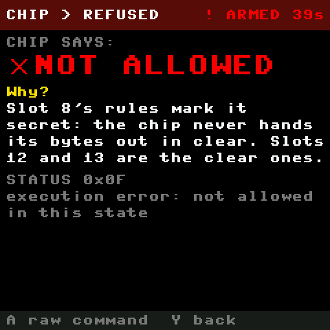

In the LAB the same idea has one more layer. An answer screen gives the meaning in words and the
bytes; when the answer is odd (`MAKE RANDOMNESS` on an unlocked chip returns `ffff0000` eight
times) it offers `WHY THAT'S WEIRD >`; `RAW COMMAND >` is there whenever a command was sent.

`PLAY SNAKE` is the one row that asks you instead of the chip. The flip-phone game runs full
screen on the wallet's 50 ms tick; every press goes into a pool (which key, how many ticks since
the last press, the microsecond clock) and every apple after the first is placed from a SHA-256
of that pool. When a game ends, A shows the report on the same answer screen: how many bits the
presses were worth, counted honestly (only the gap between presses is credited, by NIST SP
800-90B's most common value rule with its small-sample bound, so a few evenly timed presses are
worth almost nothing), the pool digest as the bytes, `HOW IT WAS COUNTED >` for the method, and
one line on how the chip's own Random compares. Nothing from the game ever becomes a key.

A score in the top ten gets the arcade box: three letters, the stick to pick them, A to file the
entry. The table lives in `snake.top` on the Pico's flash and is written into the chip's DATA
slot 13 as well (72 bytes, the free clear slot under the wallet config; 12 is the note's), 64 bytes
as two 32-byte blocks: a `SNK1` header and ten entries of three letters and a 16-bit score. The box
carries the yellow `~` badge for that write. X on the title or the GAME OVER box shows the table
and what the chip did with it: while the DATA zone is open the chip takes the table but reads
nothing back (the same lesson as the note), and after LOCK DATA ZONE the chip's copy is read first
and wins, so a reflashed Pico gets its scores back from the chip. A slot whose rules say Always
keeps taking clear writes after that lock (datasheet; not yet seen on silicon), which is why the
wording on the DATA lock screens says "clear writes only where the rules say Always".

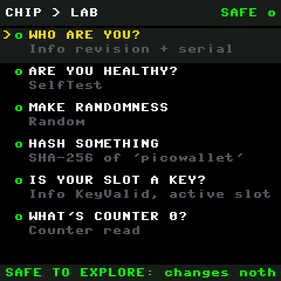
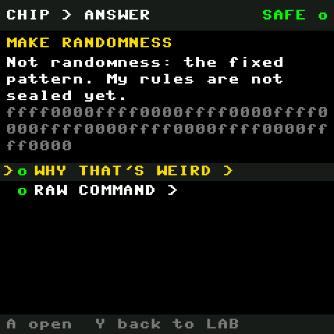
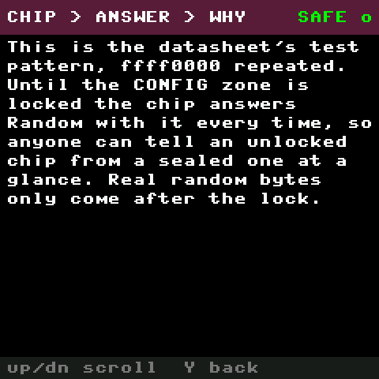

What the real fresh ATECC608A answered on 2026-09-16 is in `UPSTREAM.md` section 3b. In short:
it identifies itself, passes its self tests, hashes (matching the Pico's SHA-256) and reads its
counters while unlocked; it refuses OTP and data reads with `0x0F`; Info GPIO refuses with `0x03`.

## The reversible writes

A fresh chip has exactly one region you may write: the config zone, and only until it is locked.
Writing it again overwrites it again. So the wallet offers the write as a **reversible change**:

1. Before the first write, the chip's current 128 bytes are saved once to `snapshot-<serial>.bin`
   on the Pico's flash (`ChipSigner.save_snapshot`). It is never overwritten. It is *this chip's*
   original bytes, not a Microchip default.
2. The yellow screen shows the diff first (`atecc.diff_config`): how many bytes change, which slots
   change kind (`slot 1: P256 -> DATA`), and that the I2C address byte stays put.
3. `atecc.write_config` refuses to change byte 16 (the I2C address: the chip would answer somewhere
   else after its next wake) and refuses if the zone is locked. It writes the 27 writable 4-byte
   words (words 0-3 and 21 are read-only), then reads the whole zone back and compares bytes
   16-83 and 88-127 with what it wrote.
4. The result screen shows three checks: `WRITE COMPLETE`, `READBACK MATCHES`, `CONFIG STILL OPEN`,
   and "N bytes changed. Nothing has been permanently locked."
5. `RESTORE SAVED CONFIG` is the same flow with the snapshot as the target. `COMPARE WITH SAVED`
   shows the diff without writing.

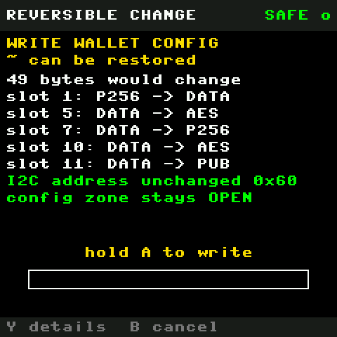
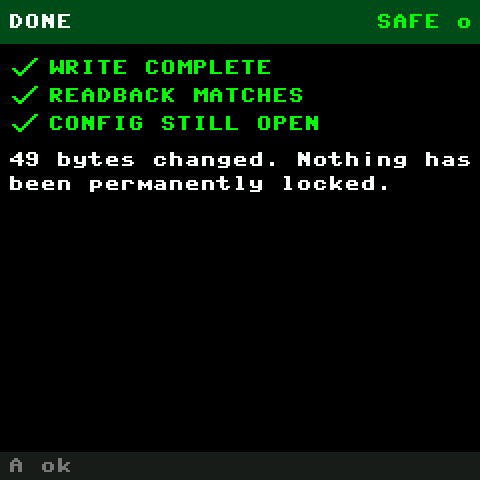

After the lock a second reversible write appears: **WRITE A NOTE** on a clear data slot (with the
wallet config, slots 12 and 13: 72 bytes, readable and writable in clear) puts 32 bytes of text
there, reads them back, and can be overwritten as often as you like until the data zone is locked.
`READ THE BYTES` shows what a readable slot holds.

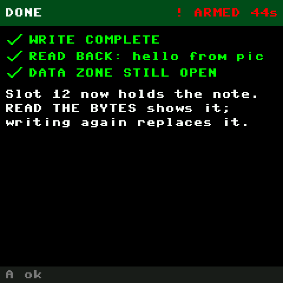

The CONFIG page names what is on the chip: `CURRENT original bytes`, `wallet config`, or
`modified` (a partial write, which RESTORE fixes), and whether a snapshot exists.

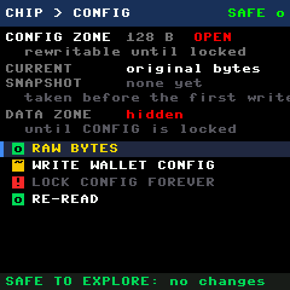

`LOCK CONFIG FOREVER` is offered only when the chip already holds the wallet table, so the old
one-step "write + lock" is now two steps with a checkpoint you can undo in between.

## The public key as a QR code

On `SHOW PUBLIC KEY`, A draws the key as a QR code filling the panel, made on the Pico by
`firmware/qrcode.py` (a small encoder: versions 1 to 6, levels L and M, alphanumeric and byte modes,
Reed-Solomon over GF(256), all eight masks scored; checked module for module against the `qrcode`
Python package and decoded back with OpenCV from the emulator's own screenshots). Left/right switch
between the two standard forms: SEC1 uncompressed `04` + x + y (130 hex characters, version 5, 37
modules at 5 px) and compressed `02`/`03` + x (66 characters, version 3, 29 modules at 6 px). Both
are uppercase hex so the QR can use its alphanumeric mode. Encoding takes about 1.2 s on the Pico,
once per key, behind the WORKING screen. Scan it with a phone and paste; the app's `.env` wants x and
y, which are the two halves after `04`.

## SIGN TEST

Once a slot holds a key, `o SIGN TEST` signs SHA-256 of `picowallet` on the chip and verifies the
signature on the Pico with the slot's public key (`p256.verify`). The result says `SIGNATURE
VERIFIED`, shows r and s shortened, and, for a slot whose rules count signatures (slot 0 under the
wallet config), reads counter 0 back: it climbs by one per signature and never comes down.

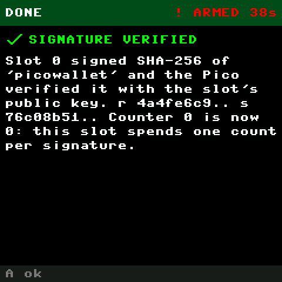

## LEARN

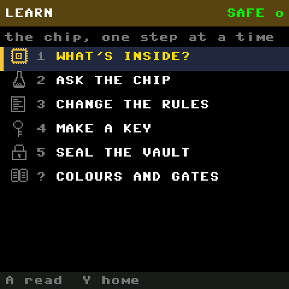

Five chapters and a card on the colours. Each chapter is a card of text with its icon; A leads into
the real screen and marks the chapter done for this boot.

## How the code is put together

- **`firmware/slots.py`** is the state machine, `SlotsUI`. `wallet.py` creates it with the LCD, the
  signer and a callback, calls `open("zones")` or `open("learn")`, and on every 50 ms tick passes
  the keys that went down; `tick()` returns `"home"` when the trail is exhausted. It draws the DATA
  screens (grid, slot, public key), the red confirm, WORKING and the result screen, and runs the
  actions, calling the ceremonies after the permanent ones.
- **`firmware/chipmap.py`** draws the map (`draw_die`, `regions`), the slot tiles (`draw_tile`), the
  CONFIG page and its write flow, OTP and COUNTERS, the refusal screen and the raw-command view,
  and holds the shared chrome: the tinted header with the breadcrumb and ARM state, menus with
  class badges, footers, word wrap, scrolling, and the B+Y arming gesture.
- **`firmware/learn.py`** holds the LEARN cards, the context lookup (which card B opens on which
  screen), and the LAB: each question is a small function that runs one driver call and returns
  (words, bytes, why-or-None). **`firmware/snakelab.py`** is the PLAY SNAKE row: the game as a
  chip-UI view, the press pool, the entropy estimate and the report it hands to the answer screen.
- **`firmware/theme.py`** is the palette: RGB triples for the background, the panel, one identity
  colour per zone and the three classes; `shade`, `mix`, `gradient`, and which zone a screen belongs
  to. **`firmware/icons.py`** is the icon set: 25 sixteen-pixel bitmaps written as ASCII art,
  packed at import into MONO_HLSB bitmaps and blitted in any colour through a two-entry palette
  (`icons.draw(d, "key", x, y, color, scale)`). **`firmware/ceremony.py`** is the three animations.
- **`firmware/qrcode.py`** is the QR encoder, pure Python, the same file runs on the laptop for
  tests (`encode(text, level) -> (n, rows)` in the form `wallet.draw_qr` uses).
- **`firmware/splash.py`** is the boot screen; **`firmware/signer.py`** gained `arm / disarm /
  armed`, `gate`, the snapshot functions, `write_config`, `restore_snapshot`, `sign_test`,
  `write_note`, `read_note`; **`firmware/atecc.py`** gained status-code names, a `trace` of the last
  command, the read-only commands, `write_data`, slot sizes and write/read policy in
  `decode_slot`, `diff_config`, and the address guard plus readback in `write_config`.

Navigation is a trail. `ui.go(view)` pushes the current screen onto `ui.stack` and `ui.back()`
pops it; the breadcrumb is rendered from that stack. Short-lived screens (WORKING, results,
refusals, the confirms, a LAB answer) do not go on the trail; they remember `ui.ret`, the screen to
return to, so A or Y lands where you were.

Things worth knowing if you change it:

- **B and Y are delivered on release** inside the chip UI (`chipmap.arm_tick`), except inside
  PLAY SNAKE, where B pauses and Y quits on press and B+Y cannot arm. Otherwise pressing
  B then Y to arm would first open a card or go back. A B or Y that was part of a B+Y hold is
  swallowed until both are up.
- **Draw only when dirty, and know the cost.** On the real panel a `show()` is 46 ms, a cached icon
  blit about 1.3 ms, text and rectangles nearly free; the map draws in about 60 ms, the grid with
  its 16 icons in 70 ms. Screens set `ui.dirty` on input, the header's countdown once a second,
  the arm bar five times a second while holding. Redrawing every tick starves the REPL so badly
  mpremote cannot connect (this happened once).
- The screen is 240 px wide with an 8×8 font: 29 characters per line at the 4-pixel margin, 12 px
  per text row. Anything longer is wrapped by `chipmap.wrap` or scrolled by `draw_scroll`.

## The virtual chip

`emu/core/shims/atecc_sim.py` answers on the emulator's I2C bus at 0x60 with the real packet
protocol. A fresh virtual part carries the factory table read off a real Adafruit breakout (slots
0-2 typed P-256, GenKey allowed), returns the fixed `ffff0000` pattern for Random until the lock,
answers Info KeyValid and State, SelfTest (all pass), SHA-256 and counter reads, refuses OTP and
data reads with `0x0F` until the config lock, takes clear data writes after it (persisted), and
spends a count on counter 0 for every signature from a LimitedUse slot. OTP writes are not
modelled.

Recipes that exercise it headless (`tools/emu headless main ...`):

```sh
# the map, the grid, slot 0
tools/emu headless main --wait 2800 --key X --wait 400 --shot map.png --key down --key A --wait 400 --shot grid.png
# arm, then look at the config page armed
tools/emu headless main --wait 2800 --key X --hold B --hold Y --wait 3400 --release B --release Y --key A --wait 400 --shot cfg.png
# write the wallet config (hold A on the yellow screen), then seal it (hold A 3 s on the red one)
tools/emu headless main --wait 2800 --key X --key A --key down --key A --hold A --wait 1900 --release A --wait 1200 --key A \
  --hold B --hold Y --wait 3400 --release B --release Y --key up --key up --key up --key A --hold A --wait 3400 --release A --wait 2600 --shot sealed.png
```

On the real board, `TESTPLAN.md` phase 4b walks the read-only tour and the write-and-restore round
trip, and phase 6 the sealing, each step checked with `tools/usb run firmware/chipcheck.py`.

## What is not here yet

- OTP writes, PrivWrite, counter increments on purpose, encrypted reads and writes.
- Balances per key, which needs a lookup route in the app.
- A custom rule table for the chips still to arrive: design it on the emulator first.
