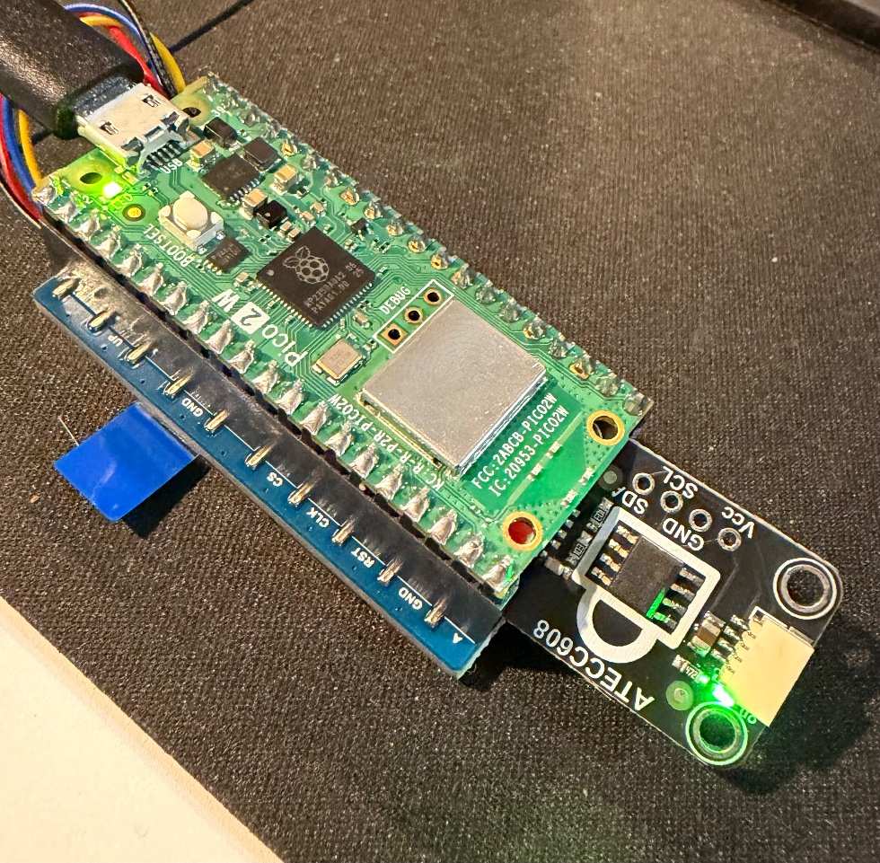
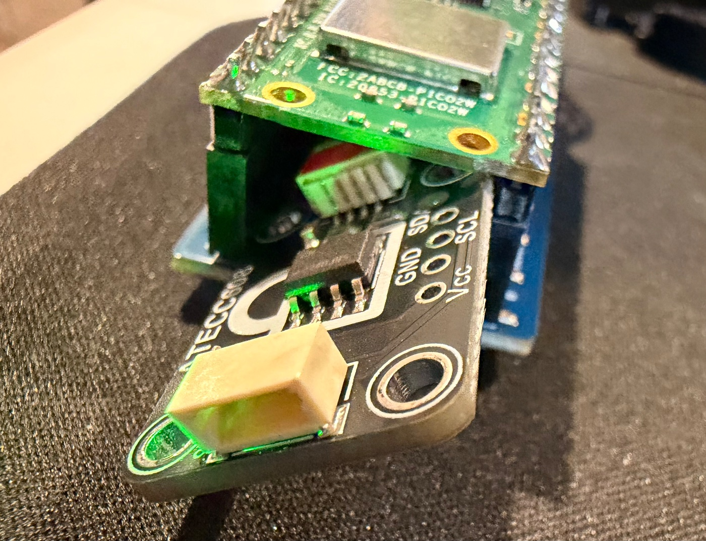

# picowallet

A hardware wallet for one stablecoin, built from three off-the-shelf parts in an evening, no
soldering. It shows your balance in dollars. When a website asks it to send money, it puts the
amount and the recipient on its own screen and does nothing until you press the green button.


The main flow is deliberately narrow: one token (USDS), one vault contract, one key that lives in
a secure element and never leaves it. An advanced hardware-signed call can recover other assets or
interact with contracts. Fork it, swap the token, redraw the screens, print a different case.

On 2026-09-05 it sent 69 USDS to atg.eth on Ethereum mainnet:
[`0x87638ae1…`](https://etherscan.io/tx/0x87638ae169eccb9f002d4eb6ce8b60e7d6603e4d3d4e562164ea10e9023f9313).

> **Security notice:** that historical deployment is legacy authorization v1 with a mutable signer.
> Do not fund or copy it. Current source is authorization v5; read [`SECURITY.md`](SECURITY.md) before use.

## Current contract

Authorization v5 is deployed on Ethereum mainnet at
[`0x4564fA634b073AcBcA814DCA5210835EC9376324`](https://etherscan.io/address/0x4564fA634b073AcBcA814DCA5210835EC9376324).

- No admin, upgrade, or unsigned spending path.
- Hardware-signed USDS transfers and arbitrary contract calls.
- ETH and accidental-token recovery through signed calls.
- Hardware-signed ENS reverse-name setup.
- Fixed recovery wallet with a 14-day signer-change delay. Any valid current-chip action cancels it.

**Audit:** [One Dollar Audit engagement 850](https://www.onedollaraudit.com/audit/850) reviewed this
exact deployment on 2026-09-06. [Full report](https://bafkreiha7yyl727uubma4shj2f5z5mlnezuya7wqg7yzqkjaqr443k4eg4.ipfs.community.bgipfs.com/):
3 high, 3 medium, 4 low, 3 informational. Its main warnings are known trade-offs: a compromised chip
can keep cancelling recovery, approvals can outlive signer recovery, and the fixed recovery wallet
is a single point of failure. This is a PoC, not an audit guarantee.

## How it works

```
website ──"send $5 to atg.eth"──▶ app (queue + relay, runs on your laptop)
                                     │  the wallet polls over WiFi
                                     ▼
                              picowallet
                              rebuilds the EIP-712 digest from the fields it shows you
                              screen:  SIGN  $5 USDS to atg.eth  REJECT
                              ATECC608 signs the digest (P-256), key never leaves the chip
                                     │  (r, s)
                                     ▼
                         relay pays gas ──▶ ChipAccount.executeTransfer ──▶ USDS.transfer
```

- The key is generated inside an **ATECC608** secure element and cannot be read out.
- On chain, a small vault contract (`ChipAccount`) holds the stablecoin and moves it only with a
  valid P-256 signature from the current hardware key, over a digest that
  includes recipient, amount, nonce, deadline, chain and contract. There is no admin or upgrade.
  A fixed recovery wallet can rotate the signer only after an uninterrupted 14-day delay.
- The wallet **rebuilds the digest itself** from the security-critical raw fields and refuses a
  mismatch. Names, symbols, and formatted values are untrusted display hints; production forks must
  pin the chain/vault/token and use authenticated transport as described in `SECURITY.md`.
- The relay just pays gas. It has no contract privilege and cannot replace the signer.
- Chip-signed general execution can recover accidental tokens/ETH and interact with contracts.
  The signature covers the exact target, ETH value, calldata, nonce, deadline, chain, and wallet.
  This is powerful: approve unknown calls only after decoding every field.

## 1. Order the parts

| part | ~price | link |
|---|---|---|
| Raspberry Pi Pico 2 W, **pre-soldered header** | $12 | Amazon `B0DRJXPPWL` (Freenove) or any Pico 2 W with headers |
| Waveshare Pico-LCD-1.3 (240×240 IPS, joystick, A/B/X/Y) | $15 | Amazon `B092VVCBQP` |
| Adafruit ATECC608 breakout, STEMMA QT | $6 | Adafruit 4314 |
| STEMMA QT / JST-SH 4-pin cable, any ends | $1 to $8 | Amazon `B08HQ1VSVL` (the kit we used, several ends), or single: Adafruit 4209 ($0.95, snip the pins off and strip) |
| micro-USB cable, data not charge-only | | |

About $35. No soldering iron.

Next hardware (in progress, needs soldering): the key moves into a plug-in McGuffin, with a bigger
screen, a dial and an 18650. See [`hardware/MCGUFFIN.md`](hardware/MCGUFFIN.md).

## 2. Print the case

`case/waveshare-13-pico-lcd-case-tomas-plass.stl`: both halves in one file, PLA, 0.2 mm layers,
no supports. Snaps together, micro-USB slot on the end, screen window, the four buttons and the
joystick poke through. Keycaps and a joystick dome are in `case/out/` (PLA, 0.12 mm layers).
`case/gen.py` regenerates them if your parts differ.


## 3. Put it together



1. Plug the Pico into the LCD board's female header, component side toward the LCD, USB at the
   joystick end.
2. Plug the STEMMA QT cable into the ATECC breakout.
3. Push the cable's four bare wires into the LCD board's header socket **beside** the Pico pins.
   The spring contact grips both. Counting from the USB end, right side: red into 3V3 (pin 36),
   black into GND (pin 38). Left side: blue into GP4 (pin 6), yellow into GP5 (pin 7). Tug lightly.
4. Jam the breakout into the gap between the two boards, wires flat.



`SOLDERING.md` has the pinout diagram and the soldered version if you want it permanent.

## 4. Flash the firmware

1. Hold BOOTSEL on the Pico, plug it into a computer, release. A drive named `RP2350` appears.
2. Drag [MicroPython for the Pico 2 W](https://micropython.org/download/RPI_PICO2_W/) (`.uf2`)
   onto it. The drive disappears and the board reboots.
3. On the computer: `uv tool install mpremote` (or `pip install mpremote`).
4. Copy `firmware/secrets.example.py` to `firmware/secrets.py`. Put in your WiFi and the app URL
   (step 6 gives you that, `http://<your-laptop-lan-ip>:3001`).
5. First time, over USB: `mpremote cp firmware/*.py :` then `mpremote reset`.

The passwordless WiFi console is disabled by default because it grants full control of the signer.
For isolated development only, set `ENABLE_NETWORK_CONSOLE = True`; then `./tools/push` deploys
firmware over the air and `./tools/pico` opens the console. Disable it before holding real value.

The screen comes up, finds the chip on the bus, and shows "no key" until step 5.

## 5. Set up the chip (once)

A fresh ATECC608 refuses to make a key until its config zone is locked, once, permanently. This
is normal; every chip in use is locked. Generate the final key before deploying the contract:

1. In `firmware/secrets.py` temporarily set `ALLOW_LOCK = True` and `ALLOW_GENKEY = True`.
2. Over USB, lock the config zone and generate the key. Record the public `qx` and `qy` values.
3. Set both flags back to `False`, leave `ENABLE_NETWORK_CONSOLE = False`, and flash again.
4. Put `qx` and `qy` in `app/packages/foundry/.env`, set a fixed `RECOVERY_ADDRESS`, and deploy.
   Losing the chip starts the documented 14-day recovery process.

`reference/pi/README.md` shows the equivalent provisioning flow from a Raspberry Pi with real output.

## 6. Run the app

`app/` is a Scaffold-ETH 2 project: the vault contract, a Next.js site, and the queue and relay as
route handlers. Locally, with play money:

```sh
cd app && yarn install
yarn chain                                  # anvil, a local chain
yarn deploy                                 # requires CHIP_PUBKEY_X/Y in packages/foundry/.env
yarn workspace @se-2/nextjs dev -p 3001     # http://localhost:3001
```

The wallet announces its key to the app. `/setup` verifies that it matches the current on-chain
key. The screen shows the vault balance and a QR of the vault address. Type a recipient and an
amount on the Send page. The wallet turns green. Press A. Watch it settle.

Mainnet, with real money, in `app/packages/nextjs/.env.local`:

```
NEXT_PUBLIC_TARGET_NETWORK=mainnet
NEXT_PUBLIC_ALCHEMY_API_KEY=<a restricted project-specific key>
RELAYER_KEYSTORE=<a foundry keystore name>          # an account with a little ETH for gas
RELAYER_KEYSTORE_PASSWORD_FILE=/path/to/password.txt
USDS_ADDRESS=0xdC035D45d973E3EC169d2276DDab16f1e407384F
```

Deploy your own vault with the chip's public key baked in (the Setup page shows it):

```sh
# app/packages/foundry/.env: CHIP_PUBKEY_X/Y=0x… USDS_ADDRESS=0x… ENS_REVERSE_REGISTRAR=0x…
cd app && yarn deploy --network mainnet --keystore <name>
```

Send USDS to the vault address it prints. Scan the QR on the wallet to get that address into
your phone wallet. Each transfer costs the relay about 82k gas.

For ENS, first create a subname such as `hard.atg.eth` and make its ETH record point to the vault.
Then use **Set the vault ENS name** in the app and approve the exact name on the device. This sets
reverse/primary resolution only; it does not create the subname.

Recovery uses the fixed `RECOVERY_ADDRESS` chosen at deployment. That wallet proposes a new P-256
key, waits 14 days, then finalizes. Any successful current-chip action cancels the proposal; the app
also has **Cancel on Pico**. Monitor `RecoveryStarted` events. See `SECURITY.md` before funding.

## The screens


**Home:** balance in dollars, a QR of the vault to deposit into, chain label top-left so test money
and real money never look alike, pairing dot top-right, a warning line along the bottom (relay
gas low, unpaired, app unreachable). Refreshes every 12 s and flashes the delta when money moves.

**Sign:** green SIGN bar in line with the A button, red REJECT bar in line with Y. Amount,
recipient name and address between them. Joystick down shows nonce, deadline, chain, vault and the
digest the device computed.


## Change it

- **Another token:** set `USDS_ADDRESS` before deploying. The token address is immutable, so changing
  assets requires a new vault.
- **Another chain:** `targetNetworks` in `app/packages/nextjs/scaffold.config.ts`. The wallet
  shows the chain id it is told and bakes it into the digest.
- **The screens:** `firmware/wallet.py`, functions `draw_home` and `draw_confirm`. 240×240,
  framebuf, an 8×8 font scaled up. Try it on the virtual wallet first: `tools/emu` opens
  http://localhost:4242 with the same MicroPython running the same files, the case in 3D and
  the keyboard on the buttons (W A S D, space, numpad 9 6 3 .); `tools/emu run NAME`, `key A`, `shot` drive it from a terminal
  (`emu/README.md`). To have an AI write for it, give it `emu/SKILL.md` and this repo; in Claude
  Code it is the `/pico-emu` skill. Then `./tools/push` and look.
- **The case:** `case/gen.py`, CadQuery, every dimension is a named number at the top.
- **The contract:** `app/packages/foundry/contracts/ChipAccount.sol`, with 34 tests.

## What is where

| path | what |
|---|---|
| `firmware/` | MicroPython for the Pico: `wallet.py` loop and screens, `atecc.py` chip driver, `signer.py`, `eip712.py` + `keccak.py` + `p256.py` pure-Python crypto, `lcd.py`, `net.py` |
| `app/` | contracts, tests, site, relay |
| `case/` | STLs, the generator, the measurements |
| `emu/` | the virtual wallet: MicroPython in WebAssembly, `machine` shims, the case STLs in 3D, a CLI for bots |
| `tools/` | `pico` console, `push` firmware, `qr` (QR of the vault for the screen), `emu` (the virtual wallet) |
| `buildlog/` | dated notes and photos of what actually happened, including the mistakes |
| `reference/` | the Pi signer this grew out of, with the fresh-chip guide; SeedSigner cap parts (MIT) |
| `PLAN.md`, `SOLDERING.md` | the plan, and the wiring guide |

## Trust model, short

The current chip key is the only thing that can spend the vault. The delayed recovery wallet can
replace that key but cannot spend directly. The relay only pays gas. The app
has no auth, so anyone who can reach it can queue deceptive requests or cause denial of service;
keep it on a trusted network for this PoC. The passwordless development console must stay disabled
when holding value. Read [`SECURITY.md`](SECURITY.md) before funding a deployment or publishing the
app to the internet.

## Credits

Grew out of [ATECC608-demo](https://github.com/clawdbotatg/ATECC608-demo) (a Pi doing the same
job). Case v0 by [Tomáš Plass](https://www.printables.com/model/1322102-waveshare-pico-13-lcd-case),
CC BY-NC. Cap and joystick geometry learned from the
[SeedSigner](https://github.com/SeedSigner/seedsigner) enclosures, MIT. App scaffold by
[Scaffold-ETH 2](https://scaffoldeth.io).

## License

MIT for everything here except where noted: the v0 case STL is Tomáš Plass's, CC BY-NC 4.0;
the SeedSigner parts in `reference/seedsigner/` are MIT with their own copyright; `app/` carries
Scaffold-ETH 2's MIT license.
