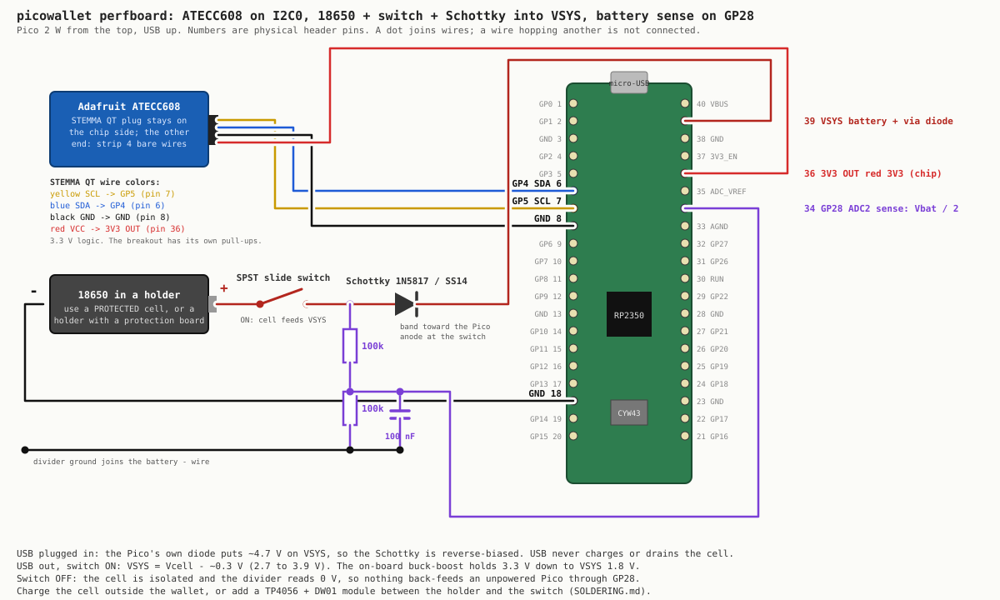

# Soldering: the perfboard build

The no-solder build in the README wedges the ATECC's wires into the LCD board's header. This is
the permanent version: Pico and LCD on a perfboard, the ATECC608 soldered to the Pico's pin tails,
and an 18650 cell behind a switch and a diode so the wallet runs unplugged but still programs
and powers over USB.



Everything below solders to the **outside of the Pico's header pins** (the tails that poke through
the perfboard), so nothing on the Pico or the LCD board is modified. Physical pin numbers count
from the USB end: 1 to 20 down the left side, 40 to 21 down the right side, looking at the Pico
from the top with USB up.

## Parts

| part | notes |
|---|---|
| Adafruit ATECC608 breakout (4314) | fresh chip. Keep its STEMMA QT plug; strip the other end of the cable |
| 18650 cell, **protected**, or an 18650 holder with a DW01 protection board | a bare unprotected cell has no over-discharge or short protection; do not use one |
| 18650 holder with leads | |
| SPST slide switch | rated for 1 A is plenty; the wallet draws under 150 mA |
| Schottky diode, 1N5817 / 1N5819 (through-hole) or SS14 (SMD) | low forward drop (~0.3 V). A plain 1N4007 drops 0.7 V and wastes range; do not use one |
| 2 × 100 kΩ resistors, 1 × 100 nF capacitor | the battery gauge. Optional, the firmware copes without |
| hookup wire, 26 to 30 AWG | |

## 1. The chip: four wires

| STEMMA QT wire | goes to | Pico pin |
|---|---|---|
| red (VCC) | 3V3 OUT | 36 |
| black (GND) | GND | 8 (any GND works; 8 sits right next to GP5) |
| blue (SDA) | GP4 | 6 |
| yellow (SCL) | GP5 | 7 |

The breakout carries its own I2C pull-ups and runs on 3.3 V, so nothing else is needed. GP4/GP5
are I2C0, the pins `firmware/atecc.py` uses. Three of the four wires land on the left column
(6, 7, 8); only red crosses to the right column (36). Keep the I2C pair short and away from the
battery leads.

Check before power: with a meter in continuity mode, red to pin 36, black to pin 8, blue to pin 6,
yellow to pin 7, and no continuity between red and black.

## 2. Battery, switch, diode

```
18650 (+) ──── switch ────┬──── Schottky ►|──── VSYS (pin 39)
                          │       anode   cathode (band)
                          │
                       100k
                          │
                          ├──────────── GP28 (pin 34)     sense = Vcell / 2
                          │      │
                       100k    100nF
                          │      │
18650 (−) ────────────────┴──────┴──── GND (pin 18 or 13; any GND)
```

- **Diode direction:** band (cathode) toward the Pico. Anode toward the switch. Backwards it never
  powers the Pico; that is the only way to get it wrong, and it is harmless.
- **Where it connects:** VSYS is pin 39, the second pin from the USB end on the right side. Not
  VBUS (pin 40), not 3V3 (pin 36). VSYS is the input the Pico's own regulator runs from and
  accepts 1.8 to 5.5 V.
- **The switch** sits between the cell and everything else. OFF isolates the cell completely,
  including the sense divider.
- **The divider** taps the switched cell voltage before the diode, so the reading is the real cell
  voltage, not VSYS. Two equal resistors halve it: a full cell (4.2 V) reads 2.1 V on GP28, safe
  for the 3.3 V ADC. The capacitor steadies the reading; the Pico's ADC likes a low source
  impedance. If you skip the gauge, leave GP28 unconnected; the firmware reads ~0 V and shows USB.

Why this is safe with USB plugged in: the Pico has its own Schottky between VBUS and VSYS. With USB
present VSYS sits at about 4.7 V, higher than any cell, so the external diode is reverse-biased and
no USB current reaches the cell. USB can never charge a bare cell through this circuit (which would
be dangerous), and the cell can never push current back into the USB port. Both sources can be
present at once; the higher one wins, that is the documented Pico pattern.

What it costs: the diode drops ~0.3 V, so VSYS is 2.7 to 3.9 V on battery. The Pico's buck-boost
holds 3.3 V down to VSYS 1.8 V, so the whole usable range of the cell is available. A 3000 mAh
cell runs the wallet with the backlight on for roughly a day; days more if you dim it.

Charging: take the cell out and charge it in a charger, or put a TP4056 module **with** protection
(the ones with a DW01 and two extra pads, usually USB-C) between the holder and the switch, with
the cell on the module's B+/B− and the switch on OUT+. Then charging happens through the module's
own USB port, never through the Pico.

Check before connecting the cell: meter in diode mode across the Schottky (reads ~0.2 to 0.3 V one
way, open the other); resistance from VSYS to GND is not a short; with the switch OFF, no path from
the holder's + lead to anything. Then fit the cell, switch ON with USB unplugged, and the screen
should come up.

## 3. Firmware side

- `firmware/power.py` reads GP28 and shows the cell voltage and a bar in the home screen's top
  row; "usb" when only USB is present; a red "battery low" warning below 3.45 V.
- The wallet finds the chip on the bus by itself. The Adafruit breakout answers at 0x60; a
  Microchip Trust&Go / TrustFLEX part answers at 0x35 or 0x6A and is found too.

## 4. Exploring the fresh chip without changing it

A fresh ATECC608 is inert until its config zone is locked, and that lock is permanent. Nothing in
the default firmware does it. With `ALLOW_LOCK = False` and `ALLOW_GENKEY = False` in `secrets.py`
(the shipped default), every permanent action on the wallet's KEYS screen is labelled "(off)" and
refuses with an explanation. In that state you can, from the wallet alone:

1. Press **X** on the home screen: the slot table. On a blank chip every slot shows `-`, and the
   header says `cfg OPEN`.
2. Press **X** again: the chip page. I2C address, serial number, revision (`00006002` = 608A,
   `00006003` = 608B), lock state of both zones, and `permanent actions off`.
3. **RAW CONFIG ZONE**: the 128 bytes as the factory shipped them. Bytes 84 to 87 (yellow) are the
   lock bytes, `55` = unlocked. The white rows are the slot table the chip will freeze at lock time.
4. **RANDOM (chip alive?)**: 32 bytes from the chip's hardware RNG. Proof the wiring and the
   protocol work, with no side effects.

From a laptop over the console the same things are `sig.status()`, `sig.config()`,
`sig.random()`, `atecc.scan()`. When you are ready to commit the chip, the steps in the README
("Set up the chip") still apply; from the wallet it is `WRITE + LOCK CONFIG` on the chip page,
then `NEW KEY` in slot 0, each behind a hold-A red screen once the flags are set.

The emulator (`tools/emu`) has a virtual chip that starts blank and behaves the same way, so the
whole flow can be rehearsed first, including what the screens look like after each step.
