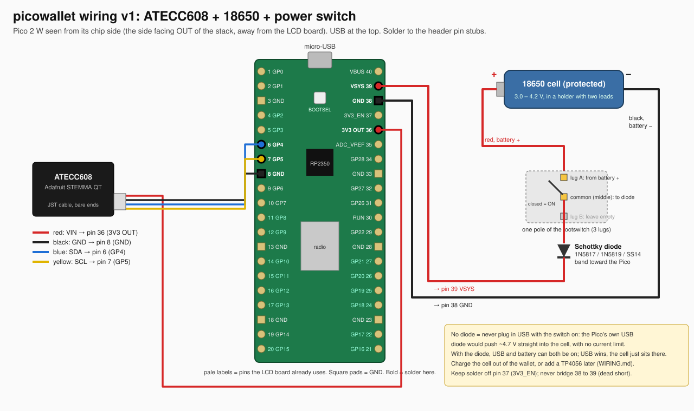

# Wiring v1: soldered ATECC608, 18650 cell, footswitch power

Six solder joints on the Pico. Four thin wires for the chip, two thicker ones for the battery.



## Which side you are soldering on

The Pico plugs into the LCD board pins-first, so its **chip side faces out**, away from the LCD
board. That is the face with the RP2350, the BOOTSEL button, the radio can, and the short header
pin stubs with their solder blobs. Those blobs are what you solder to. Nothing to unplug, but
pull the Pico off anyway so the iron never gets near the screen or the female header.

The pin labels are printed on the *other* face, hidden against the LCD board. So orient by the USB
connector and count:

- chip side up, USB at the top
- pin 1 is top left, pins run **down the left** side 1 to 20
- pin 21 is bottom right, pins run **up the right** side 21 to 40, so pin 40 is top right
- every GND pad is **square** (3, 8, 13, 18, 23, 28, 33, 38); the rest are round. Use the squares
  as landmarks: pin 8 is the second square from the top on the left, pin 38 the first on the right.

All six joints are within the top nine positions.

| joint | pin | Pico label | wire | goes to |
|---|---|---|---|---|
| 1 | 6 | GP4 | blue | ATECC SDA |
| 2 | 7 | GP5 | yellow | ATECC SCL |
| 3 | 8 | GND (square) | black, thin | ATECC GND |
| 4 | 36 | 3V3 OUT | red, thin | ATECC VIN |
| 5 | 38 | GND (square) | black, thicker | battery − |
| 6 | 39 | VSYS | red, thicker | diode band, from the switch, from battery + |

Pin 37 (3V3_EN) sits between 36 and 38: solder on it and the Pico's regulator turns off. Pin 40
(VBUS) sits next to 39: that is the USB 5 V rail, nothing goes there. Pin 38 to 39 bridged is a
dead short across the cell.

Pins the LCD board already drives, so you never touch them: GP2, GP3, GP8 to GP13, GP15 to GP21.
GP4, GP5 and VSYS are free.

## The chip: ATECC608, four wires

Same chip and pins as before (`app/SOLDERING.md` has the iron technique and the 20-years-later
walkthrough). One change: the chip's GND goes to **pin 8**, not 38, so all three signal-side wires
sit together on the left and pin 38 stays free for the battery. Any GND pin works electrically.

STEMMA QT cable colors: red VIN, black GND, blue SDA, yellow SCL. Use 28 to 30 AWG, strip 2 mm,
tin, trim to 1.5 mm, joints flat along the board.

Check before power: GP4 to GP5 must not beep, 3V3 to GND must not beep. Then the I2C scan in
`app/SOLDERING.md` should print `['0x60']`.

## The battery: 18650, footswitch, Schottky diode, into VSYS

```
18650 +  ──red──▶ switch lug A ─▶ switch common ──red──▶ |◀ diode (band at Pico end) ──red──▶ pin 39 VSYS
18650 −  ──black────────────────────────────────────────────────────────────────────────────▶ pin 38 GND
```

Three things and why:

- **VSYS, pin 39.** It is the Pico's power input, 1.8 to 5.5 V, into the onboard buck-boost that
  makes the 3.3 V. A cell is 3.0 to 4.2 V, minus 0.3 V in the diode is 2.7 to 3.9 V, well inside
  the window, WiFi included. Not VBUS (that is the USB side of the Pico's own diode; you would be
  back-feeding the USB jack). Not 3V3 (that is a regulator *output*).
- **The Schottky diode, mandatory.** The Pico has a diode from VBUS to VSYS. If the cell were
  wired straight to VSYS and you plugged in USB with the switch on, VSYS would sit at about 4.7 V
  and that would flow straight into the cell with no current limit: overcharge, heat, possibly
  fire. With your diode in the cell's + lead, USB simply wins (4.7 V beats 3.9 V), the diode is
  reverse-biased, and the cell just sits there. So you can flash and debug over USB with the
  battery switched on. Any 1 A Schottky: 1N5817, 1N5819, SS14, SB140. Drop is 0.2 to 0.35 V,
  which the 18650 does not care about.
- **The switch in the + lead.** Off means the cell is disconnected from everything. No drain,
  nothing to sleep.

### Parts

- **Protected 18650** (a cell with its own little protection PCB), or a bare cell plus a 1S
  protection board. Reason: the Pico keeps running down to 1.8 V on VSYS, which means about
  2.1 V at the cell. That is deep over-discharge for a lithium cell; the floor is 2.5 to 3.0 V.
  A protected cell cuts itself off first. Protected cells are ~69 mm long, not 65, so check the
  holder.
- Schottky diode as above.
- Wire: 22 to 26 AWG for the two battery leads, heat shrink for the diode.
- The holder with its two leads, and the footswitch.

### Figure out the footswitch

Guitar pedal footswitches are usually 3PDT (9 lugs, three columns of three) or DPDT (6 lugs, two
columns). A mini toggle is SPDT (3 lugs) or SPST (2). You only need one pole, which is one column
of three lugs.

1. **Is it latching?** Meter on continuity, probes on any two lugs that beep. Click and release.
   Latching: the beep state stays after you let go. Momentary (soft-touch): beeps only while
   pressed. A momentary switch cannot be a power switch; it would need a latch circuit.
2. **Find one pole.** In each column of three, the **middle lug is the common**. Meter between the
   middle lug and the top lug: beeps in one click state. Middle to bottom: beeps in the other.
   Those three are one pole. Pick the middle lug and **either** outer lug; the other outer lug
   stays empty. Which outer lug you pick only decides which click state is ON, and a stomp switch
   has no visible position anyway, so it does not matter.
3. Leave the other columns alone. They are isolated poles. Do not bridge across columns.
4. Tape-label the two lugs you chose.

### Polarity

- **Holder leads.** Meter on DC volts, cell in the holder, red probe on the red lead, black on
  black: expect **+3.0 to +4.2 V**. A minus sign means the leads are swapped; fix the labels, not
  the wiring. Cell orientation in the holder: the flat end is −, the nub (button) end is +, and
  the holder's spring is normally the − end.
- **Diode.** The band marks the cathode. The band goes toward the Pico. Meter on diode mode, red
  probe on the plain leg, black probe on the band leg: reads about **0.15 to 0.35 V**. Swap the
  probes: reads OL. If it reads OL both ways or ~0 both ways, that diode is dead.

### Build order

1. Cell **out** of the holder for all soldering.
2. Red holder lead to switch lug A.
3. Diode plain leg (anode) to the switch common lug. Heat shrink over the diode body.
4. Red wire from the diode band leg (cathode) to **pin 39**.
5. Black holder lead to **pin 38**.
6. Continuity checks, cell still out: 38 to 39 must **not** beep in either switch state. 37 to 38
   must not beep. 39 to 40 must not beep.
7. Cell in, switch off: meter DC volts at pin 39 to any GND: **0 V**. Switch on: **cell voltage
   minus ~0.3 V**, so 3.4 to 3.9 V. The screen should come up.
8. Switch on, USB plugged in: pin 39 reads ~4.7 V. That is the USB side winning. Fine.

### What to expect

- Runtime: Pico 2 W with WiFi idling plus the backlight draws roughly 60 to 120 mA. A 2500 mAh
  cell is somewhere around 20 to 40 hours on. Signing is a blip.
- Charging: **not in place** with this wiring. Pull the cell and use an 18650 charger. When you
  want in-place charging, a TP4056 module drops in: cell to B+ / B−, OUT+ to switch lug A, OUT−
  to pin 38, keep the diode. Its USB-C then charges the cell.
- Battery gauge: VSYS/3 is on ADC3 (GP29). On the W boards that pin is shared with the radio, so
  reading it takes care. Firmware item, see PLAN.md.

### Never

- No diode, USB plugged in, switch on. Never.
- The two holder leads touching each other. An 18650 will push 10 A or more into a short.
- The cell in the holder while soldering anything.
- Cell to pin 40 or pin 36.

## Routing into the case

Both wire bundles leave the chip side, which is the face that ends up against the case bottom.
The ATECC's four wires wrap around the end of the Pico into the gap where the breakout lives
today, or the breakout moves wherever the new case puts it. The 18650 is 18.5 × 65 mm bare,
~69 mm protected, plus the holder; the footswitch body is 12 mm across and ~25 mm deep with the
lugs. The case redesign gets a pocket for each; `case/README.md` is where those measurements go.
