# picowallet build log

## 2026-09-05 — parts on the bench

Three parts, all from Amazon. Pico plugs face-down into the LCD board's female header. The ATECC608 breakout fits in the ~11 mm gap between them.

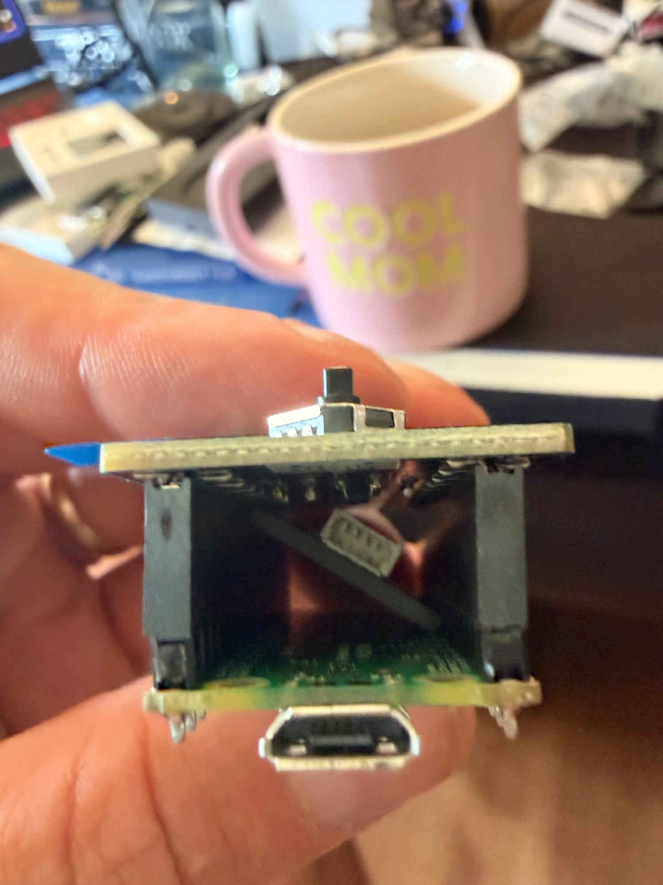
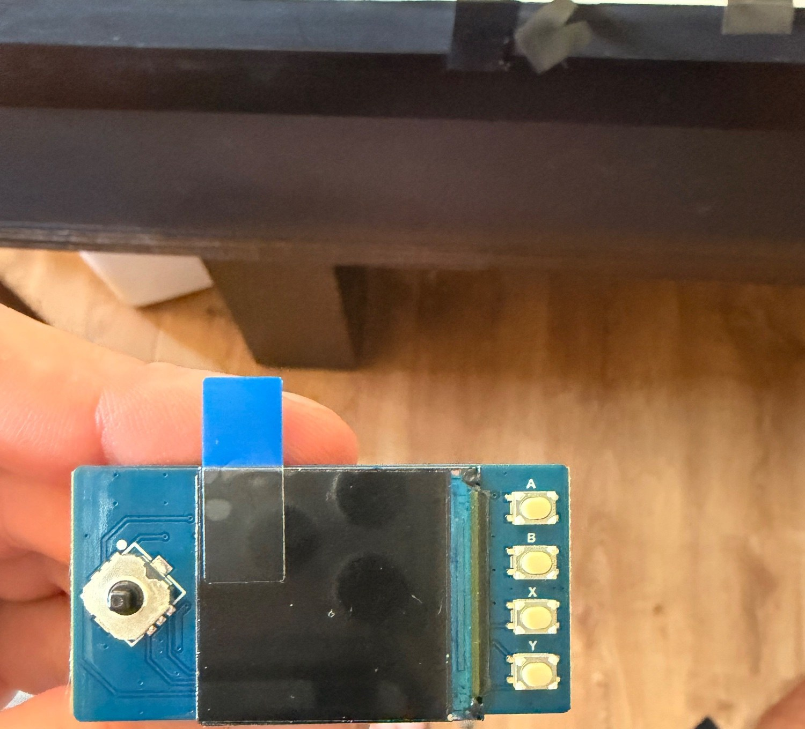
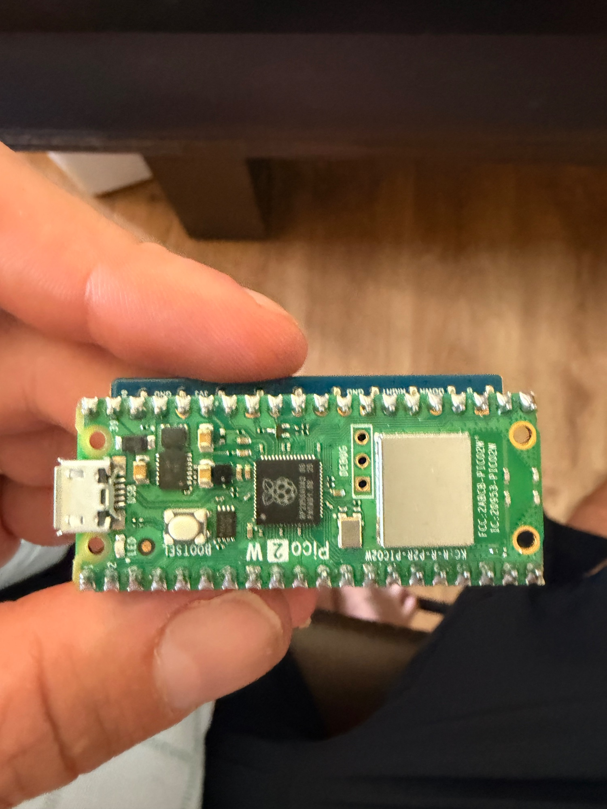

Decisions today:
- Screen and buttons work out of the box through the header. Only the ATECC and the battery need wires.
- ATECC gets 4 soldered wires to the Pico (3V3, GND, GP4 SDA, GP5 SCL). The LCD board eats every pin, no pass-through, so no jumper trick.
- Battery: solder it too, keep it in the gap.
- WiFi/Bluetooth stay on for v1. Idea: send a tx to the device over the radio, it shows it on screen, you approve, it sends the signature back.

## 2026-09-05 — first boot

Pico 2 W plugged into the omen box (Arch laptop, `ssh austin@omen.local`). Blank Pico shows up as a USB drive `RP2350`, no LED, no other sign of life. That's normal.

- Flashed MicroPython v1.26.1 (`RPI_PICO2_W-20250911-v1.26.1.uf2`) by copying it onto the `RP2350` drive.
- Board reboots as `/dev/ttyACM0`. `mpremote` installed on omen via pipx. Added `austin` to `uucp` group for serial access.
- `firmware/main.py` blinks the onboard LED. First light.

Workflow from the Mac: `scp` a file to omen, then `mpremote connect /dev/ttyACM0 cp file :file` and `mpremote reset`.

## 2026-09-05 — WiFi console

Going through omen's USB was a detour. The Pico 2 W has WiFi, so now it joins the house network on boot and listens for a console on TCP 2323. From the Mac:

```
./tools/pico ls
./tools/pico exec 'print(1)'
./tools/pico cp firmware/main.py :main.py
```

That is `mpremote connect socket://picowallet.local:2323 resume ...`. mDNS name `picowallet.local` works from the Mac. `firmware/secrets.py` (gitignored) holds the WiFi creds, template in `secrets.example.py`.

No SSH: MicroPython has no SSH server. The console has no password either, anyone on the LAN can run code on it. Fine for dev, not for the shipped firmware. LED: fast blink while joining WiFi, solid with a short blink every 2 s once up.

Gotcha: mpremote soft-resets the board before the first command, which reruns main.py and kills the socket. Always pass `resume` (the wrapper does).

## 2026-09-05 — screen and buttons

Pico stacked onto the Pico-LCD-1.3. `firmware/lcd.py` is a small ST7789 driver (SPI1 at 62.5 MHz, framebuf RGB565, PWM backlight) plus a `Keys` class for A/B/X/Y and the joystick. `firmware/ui.py` draws a title, the IP, and the last key pressed. Screen and all buttons confirmed working.

Lesson, cost an hour: on the rp2 port the network console (`os.dupterm` on a socket) is only read while the REPL is idle. A blocking `while True` in main.py makes the board deaf over WiFi, and Ctrl-C from the socket never lands. Fix: the UI runs from `machine.Timer(period=30ms)` and main.py returns to the REPL. The timer callback is scheduled (soft), so framebuf and SPI work inside it. Keep the callback quiet: prints from it would corrupt mpremote's raw REPL.

`boot.py` starts WiFi + console before main.py, so a broken main.py can still be fixed remotely.

`tools/push` copies all of `firmware/` and reboots via a one-shot Timer (so mpremote returns before the socket drops). macOS has no `timeout` command, that bit me too.

USB rescue path: the Pico's USB goes to the omen laptop. Device path there is `/dev/serial/by-id/usb-MicroPython_Board_in_FS_mode_*-if00` (the ttyACM number changes on each reboot).

## 2026-09-05 — the chip is on the wallet, no solder

The Adafruit ATECC608 from the Pi (serial `01235e6763cc8d97ee`, the key that owns the mainnet vault)
moved onto the Pico with zero solder: a STEMMA QT cable into the breakout, the four wires pushed into
the LCD board's female header beside the Pico pins (GP4 SDA blue, GP5 SCL yellow, 3V3 red, GND black),
breakout tucked in the gap. `i2c.scan()` finds `0x60`, the chip signs in 151 ms.

Firmware now: `atecc.py` driver, `signer.py` (chip if present, else software key), `wallet.py` loop
(announce, poll, show, sign on A), and the digest is rebuilt on the device from the displayed fields
before anything is shown. The home screen shows the vault's dollar balance and pairing state.
Local test stack: fork of the ATECC608-demo app on port 3001 against anvil.

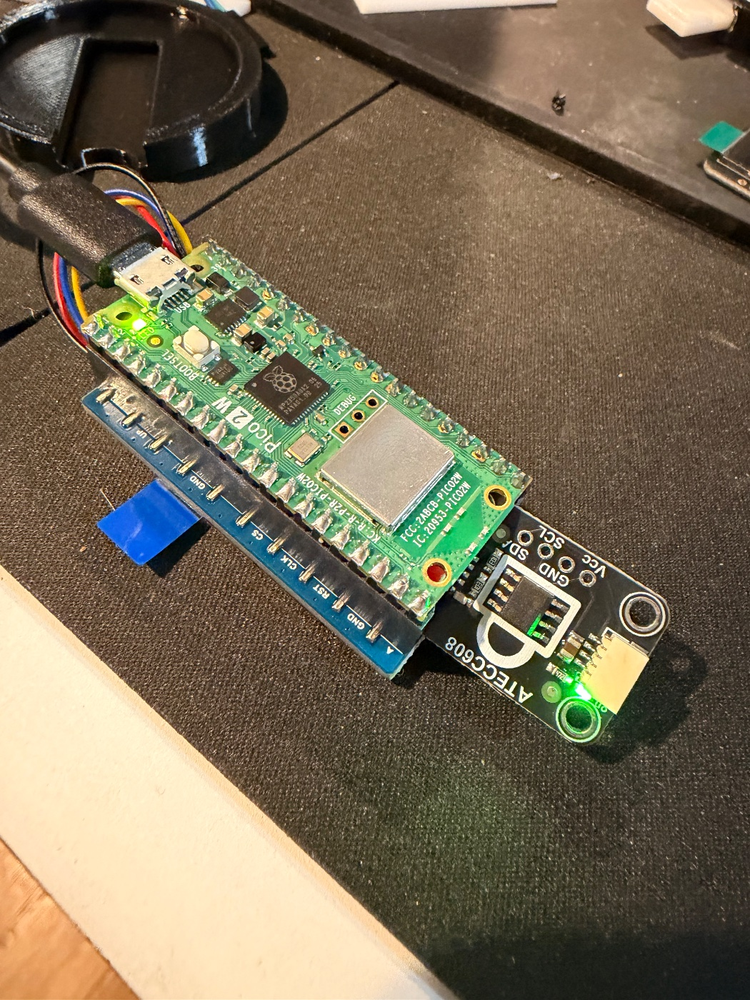
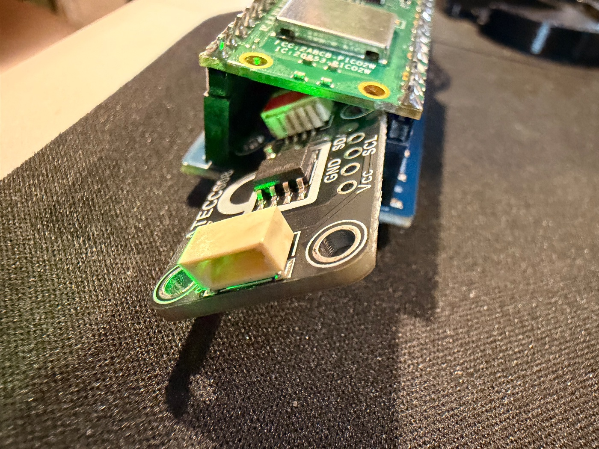
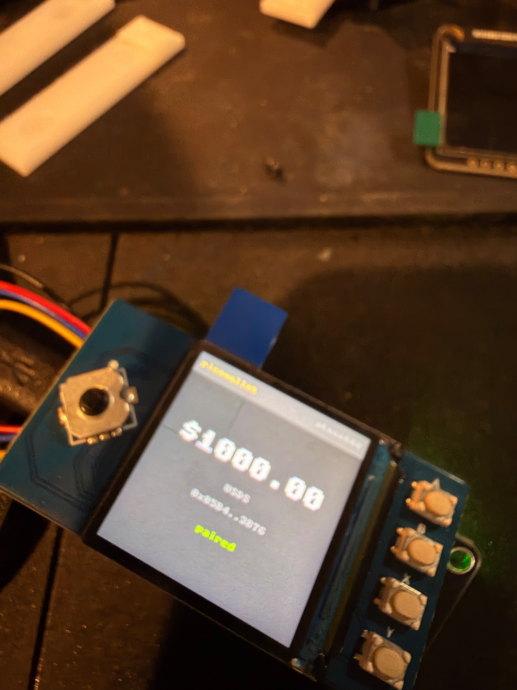
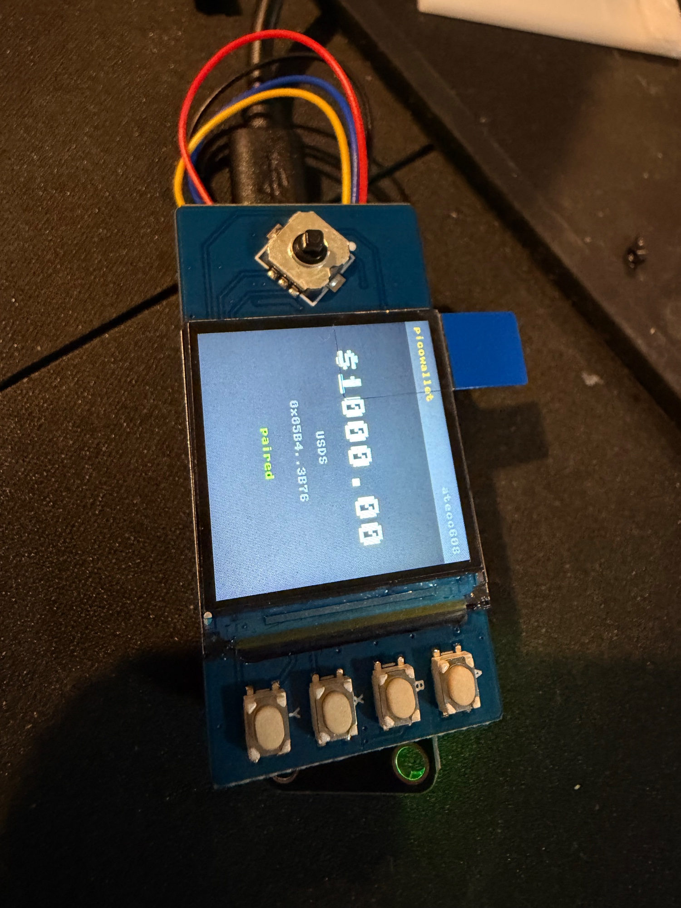

## 2026-09-05 — first signed transfer from the wallet

Whole loop, end to end, on the local chain: `POST /api/requests` for 5 USDS to atg.eth, the wallet
rebuilt the EIP-712 digest from the fields and it matched, showed "SIGN? $5 USDS to atg.eth,
A = sign B = reject", Austin pressed A, the ATECC608 signed in 150 ms, the app's relay called
`executeTransfer`, confirmed in tx `0xc7c6f72a…`. Vault 1000 → 995 USDS, nonce 0 → 1. Screen:
"SENT $5 to atg.eth". Same chip, same key that owns the mainnet vault.

Bug of the day: two soft Timers plus a blocking HTTP call fill the rp2 scheduler queue (8 deep) and
the WiFi console's accept callback gets dropped, which shows up as "connection reset by peer" forever.
One 50 ms timer now, and it stops itself during sign + relay.

## 2026-09-05 — first mainnet transfer from the wallet

5 USDS to atg.eth, signed on the ATECC608 wedged into the Pico, relayed by the app on port 3001.
Tx [`0x0fbd390b…`](https://etherscan.io/tx/0x0fbd390b3e82bc4566f9ef9c66c178e58904debaf728ec9d941b4090610c6257),
81,715 gas. Vault 124.56 → 119.56 USDS, nonce 6 → 7. Screen: green SIGN bar, press A, "SENT",
then the home screen flashed "-$5.00".

Bumps on the way, all fixed:
- Two copies of the site were running (yesterday's on :3000, the fork on :3001). A Send on :3000
  never reaches the wallet. Use :3001.
- The app had no reject path, so a Y press left the request pending and reserved its amount; the
  next proposal failed the balance check. Added `POST /api/requests/[id]/reject`.
- Mainnet latency wedged the WiFi console (scheduler queue). Timer now pauses around HTTP, the
  console drains accepts from the tick, the app caches chain reads for 5 s.
- Two signed attempts failed on "insufficient funds" while the relay held 0.000008 ETH. It needs
  about 0.000012 ETH per send at tonight's gas. Funded with 0.001 ETH.

Home screen now: balance big, small QR of the vault, chain label, pairing dot, warning line.
Confirm screen: green SIGN bar in line with A, red REJECT bar in line with Y, details on down.

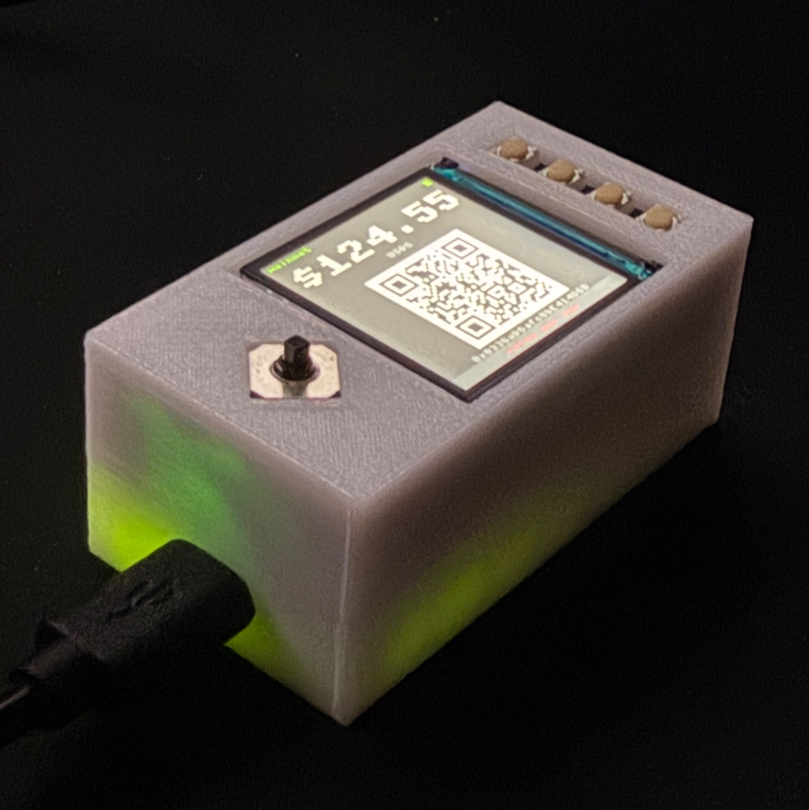
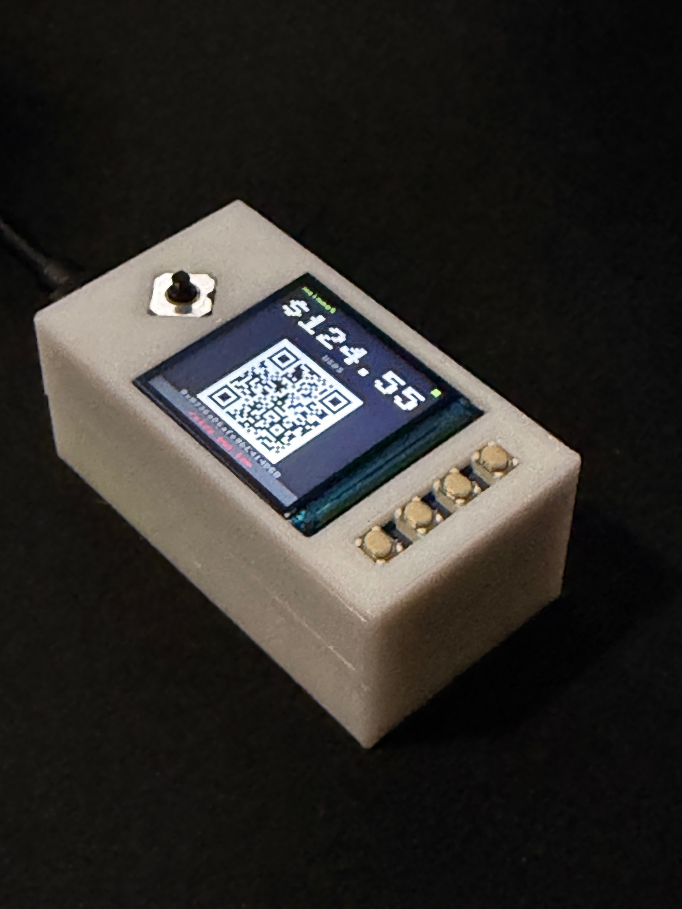
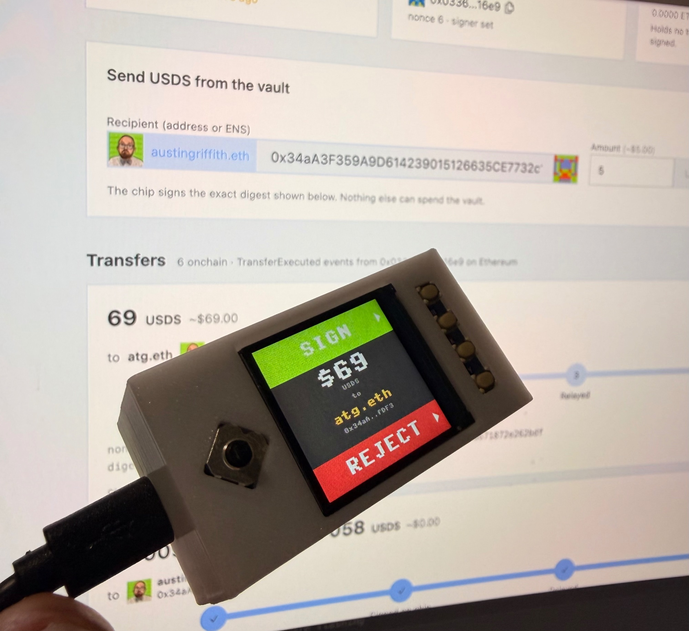

## 2026-09-05 — provisioning from the wallet, and the repo goes public-ready

`atecc.py` grew `write_config`, `lock_config` and `genkey_new`, so a fresh chip can be locked
and given a key from the app's Setup page without a Pi. Both are gated by `ALLOW_LOCK` /
`ALLOW_GENKEY` in `secrets.py` on the device, default off; with them off the wallet refuses the
commands (checked on the real chip). The lock and new-key paths have NOT yet run on a fresh chip;
the config bytes and command sequence are the ones the Pi signer used successfully on 2026-09-04.

Photos: feet cropped or dropped, files renamed by content, five good shots added. README rewritten
as the build guide: order, print, assemble, flash, set up the chip, run, change it.

Then 69 USDS to atg.eth, same way: [`0x87638ae1…`](https://etherscan.io/tx/0x87638ae169eccb9f002d4eb6ce8b60e7d6603e4d3d4e562164ea10e9023f9313). That is the one in the tweet.

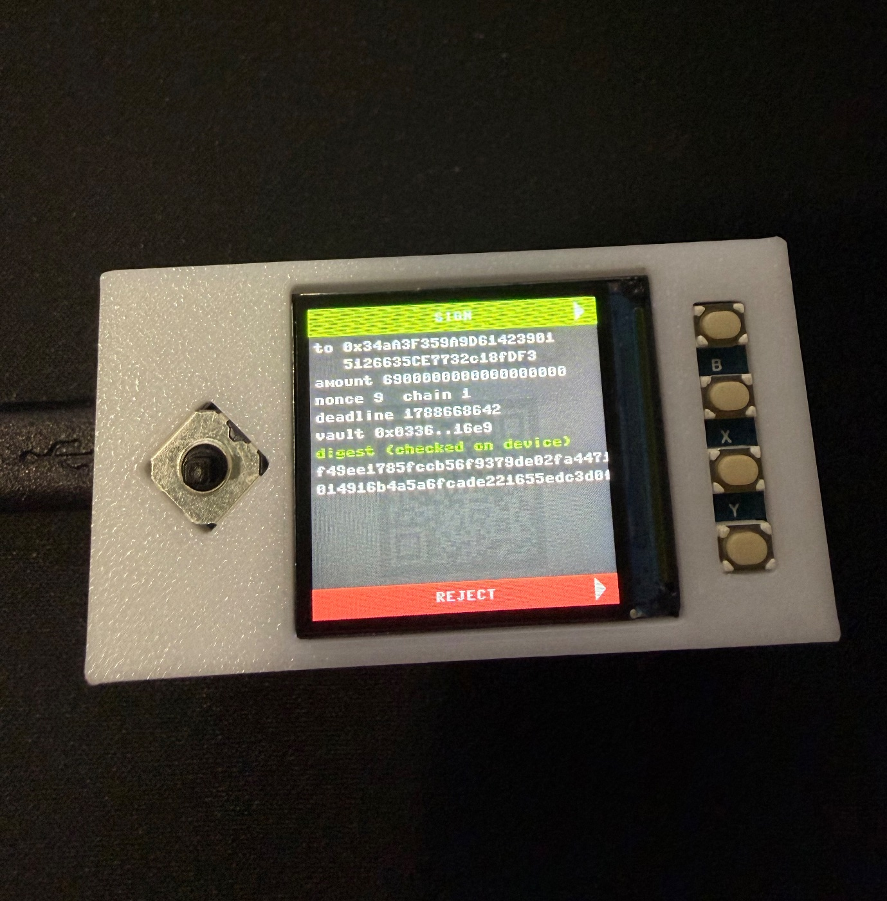
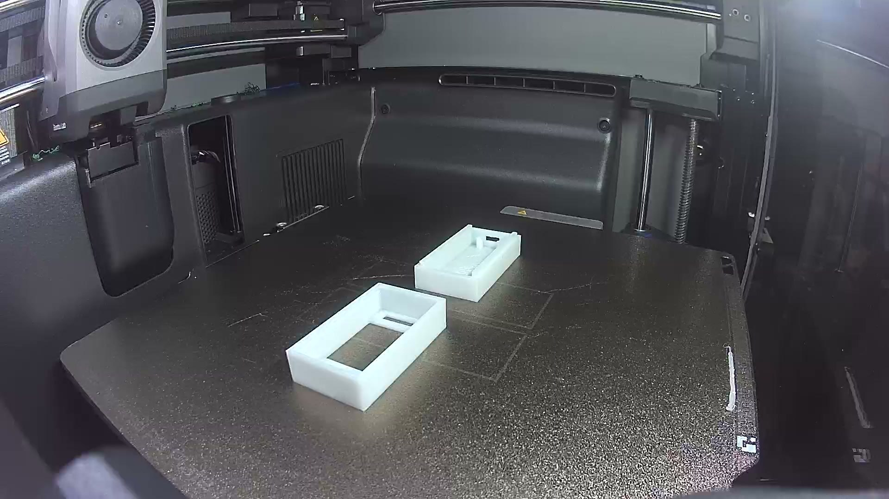
