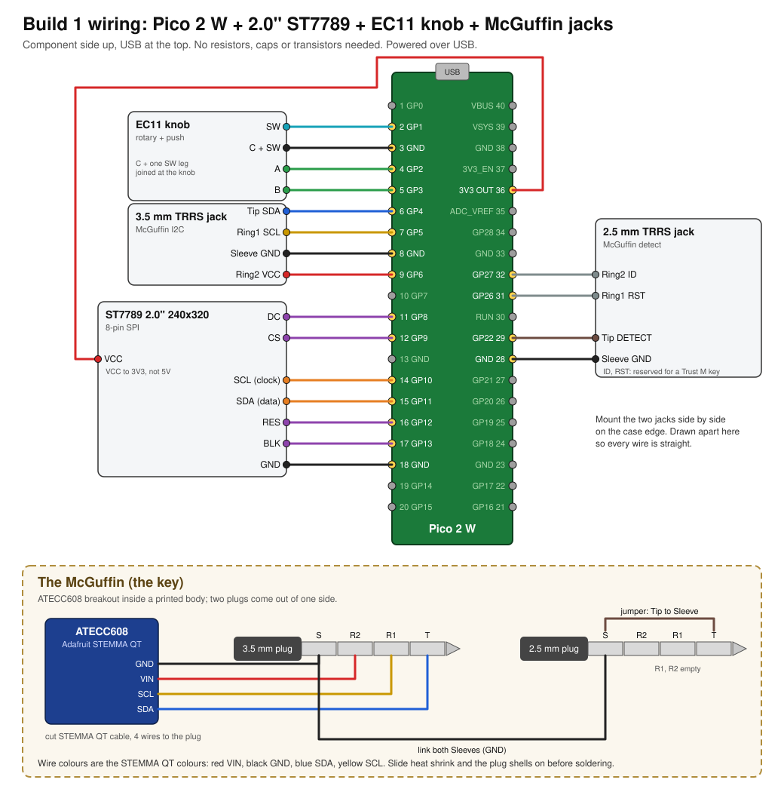

# Build 1: the parts on the bench

The first McGuffin build, using only what has arrived: a Pico 2 W, the 2.0" ST7789 screen from the
variety pack, one EC11 knob, the 3.5 mm and 2.5 mm TRRS jacks and plugs, and an ATECC608 breakout
as the key. No resistors, capacitors or transistors. Powered over the Pico's USB.

The full design with the battery, buttons and the Trust M key is [MCGUFFIN.md](MCGUFFIN.md). The pins
here are the same, so later parts get added without moving a wire.



## Parts

| part | notes |
|---|---|
| Raspberry Pi Pico 2 W | |
| 2.0" ST7789 TFT, 240x320, 8 pins | header: GND VCC SCL SDA RES DC CS BLK |
| EC11 rotary encoder with push | 3 pins on one side (A, C, B), 2 on the other (switch) |
| 3.5 mm TRRS jack + plug | 4-pole: the plug has 3 black rings |
| 2.5 mm TRRS jack + plug | 4-pole |
| Adafruit ATECC608 STEMMA QT + STEMMA QT cable | the key; unconfigured is fine for wiring |
| hookup wire, heat shrink | |

Left out on purpose: battery (MCGUFFIN.md, Power), A/B/X/Y buttons (GP15, GP17, GP19, GP21 stay
free for them), the PNP key switch and the ID resistor.

## Pico pins

Component side up, USB at the top. `*` is used in Build 1.

```
                          USB
                   ┌─────┤   ├─────┐
             GP0   1 │ o           o │ 40  VBUS
 * knob SW   GP1   2 │ o           o │ 39  VSYS
 * knob C    GND   3 │ o           o │ 38  GND
 * knob A    GP2   4 │ o           o │ 37  3V3_EN
 * knob B    GP3   5 │ o           o │ 36  3V3 OUT    screen VCC *
 * key SDA   GP4   6 │ o           o │ 35  ADC_VREF
 * key SCL   GP5   7 │ o           o │ 34  GP28
 * key GND   GND   8 │ o           o │ 33  GND
 * key VCC   GP6   9 │ o           o │ 32  GP27       key ID (reserved) *
             GP7  10 │ o           o │ 31  GP26       key RST (reserved) *
 * TFT DC    GP8  11 │ o           o │ 30  RUN
 * TFT CS    GP9  12 │ o           o │ 29  GP22       key DETECT *
             GND  13 │ o           o │ 28  GND        key GND *
 * TFT SCL   GP10 14 │ o           o │ 27  GP21
 * TFT SDA   GP11 15 │ o           o │ 26  GP20
 * TFT RES   GP12 16 │ o           o │ 25  GP19
 * TFT BLK   GP13 17 │ o           o │ 24  GP18
 * TFT GND   GND  18 │ o           o │ 23  GND
             GP14 19 │ o           o │ 22  GP17
             GP15 20 │ o           o │ 21  GP16
                   └─────────────────┘
```

### Screen (ST7789 2.0")

| screen pin | Pico | pin # |
|---|---|---|
| GND | GND | 18 |
| VCC | 3V3 OUT | 36 |
| SCL | GP10 (SPI1 clock) | 14 |
| SDA | GP11 (SPI1 data) | 15 |
| RES | GP12 | 16 |
| DC | GP8 | 11 |
| CS | GP9 | 12 |
| BLK | GP13 | 17 |

These are the v1 screen pins from `firmware/lcd.py`. SCL/SDA on this board are SPI, not I2C, despite
the names. VCC goes to 3.3 V: some of these boards have no regulator and do not like 5 V.

### Knob (EC11)

| EC11 pin | Pico | pin # |
|---|---|---|
| A (outer pin, 3-pin side) | GP2 | 4 |
| C (middle pin, 3-pin side) | GND | 3 |
| B (other outer pin) | GP3 | 5 |
| switch, one leg | GND | 3 (bridge it to C on the knob) |
| switch, other leg | GP1 | 2 |

The internal pull-ups do the work. If turning it reads backwards, swap A and B in firmware, not the
wires.

### 3.5 mm jack: the key's I2C

| contact | signal | Pico | pin # |
|---|---|---|---|
| Tip | SDA | GP4 | 6 |
| Ring 1 | SCL | GP5 | 7 |
| Ring 2 | key VCC | GP6 | 9 |
| Sleeve | GND | GND | 8 |

GP4/GP5 are the I2C pins `firmware/atecc.py` already uses.

### 2.5 mm jack: detect

| contact | signal | Pico | pin # |
|---|---|---|---|
| Tip | DETECT | GP22 | 29 |
| Ring 1 | RST (reserved for a Trust M key) | GP26 | 31 |
| Ring 2 | ID (reserved) | GP27 | 32 |
| Sleeve | GND | GND | 28 |

Wire Ring 1 and Ring 2 now even though the ATECC key leaves them empty; a Trust M key will use them
and the wallet will not need opening.

### Why key VCC comes from a GPIO

No transistor on hand, so GP6 powers the key directly. The ATECC608 idles under 1 mA and peaks
around 14 mA for a few milliseconds while signing; the breakout's own capacitor covers the peaks.
This also keeps the key unpowered while it is being plugged in, which matters: a TRRS plug wipes
every contact across every other on its way in, and a live VCC would short to GND for a moment.
MCGUFFIN.md has the PNP switch for later.

Rule until firmware does it: **GP6 low before plugging or unplugging the key.**

## Find the jack contacts first

Jack lugs are not labelled and every maker lays them out differently. For each jack:

1. Push a plug in (the one for the McGuffin is fine, before soldering it).
2. Meter on continuity. One probe on the plug's tip, touch each lug until it beeps. Mark that lug T
   with a marker. Repeat for ring 1 (next to the tip), ring 2, sleeve (next to the body).
3. Some jacks have extra lugs that beep only with no plug in: those are switches. Leave them empty.

## Making the McGuffin


1. Slide the plug shells and heat shrink onto the wires **before** soldering. Everyone forgets once.
2. Cut the STEMMA QT cable about 5 cm from the connector end that goes in the ATECC breakout. Strip
   and tin the four wires.
3. 3.5 mm plug: blue to Tip, yellow to Ring 1, red to Ring 2, black to Sleeve.
4. 2.5 mm plug: a short wire from Tip to Sleeve. Ring 1 and Ring 2 stay empty.
5. A wire from the 2.5 mm Sleeve to the 3.5 mm Sleeve.
6. Meter, before plugging in anywhere: Tip, Ring 1, Ring 2 of the 3.5 mm plug must NOT beep to each
   other or to Sleeve. Each must beep to its wire at the breakout (SDA, SCL, VIN, GND). On the 2.5 mm
   plug, Tip must beep to Sleeve.
7. Plug the cable into the breakout. The printed body comes later; for now tape the plugs side by
   side at the same spacing as the jacks.

## Knob-only controls

With one knob and no buttons: turn to move, short press to select or go back, **hold 2 s to sign**.
The hold makes a stray press unable to approve anything. A/B buttons can go on GP15/GP17 later.

## Bring-up

Paste each into the REPL (`./tools/pico` or Thonny). USB power only.

**1. Screen.** Backlight first, then the existing driver:

```python
from machine import Pin
Pin(13, Pin.OUT).value(1)          # backlight on: the screen glows
from lcd import LCD, RED
d = LCD(); d.fill(RED); d.show()
```

`lcd.py` is written for the 240x240 Waveshare board, so it fills only a 240x240 part of this
320-tall screen, maybe offset or rotated. That proves the wiring. A 240x320 size option in the
driver is the next firmware change.

**2. Knob.**

```python
from machine import Pin
import time
a, b, sw = (Pin(n, Pin.IN, Pin.PULL_UP) for n in (2, 3, 1))
last = None
while True:
    s = (a(), b(), sw())
    if s != last: print(s); last = s
    time.sleep_ms(2)
```

Turning steps A and B through `(1,1) (0,1) (0,0) (1,0)` or the reverse; pressing makes the third
number 0. Ctrl-C to stop.

**3. Jacks, no key in.** `Pin(22, Pin.IN, Pin.PULL_UP).value()` is 1.

**4. Key in.** Same line reads 0. Then power it and scan:

```python
from machine import Pin, I2C
import time
Pin(6, Pin.OUT).value(1)           # key VCC on
time.sleep_ms(10)
i2c = I2C(0, sda=Pin(4), scl=Pin(5), freq=100_000)
try: i2c.writeto(0, b"\x00")       # wake pulse
except OSError: pass
time.sleep_ms(2); print([hex(x) for x in i2c.scan()])
Pin(6, Pin.OUT).value(0)           # key VCC off before unplugging
```

Expect `['0x60']`. An unconfigured chip answers the same as a configured one.

**5. What the chip is.** With VCC on as above:

```python
from atecc import ATECC
print(ATECC().status())            # serial, configLocked, dataLocked: read-only
```

## The unconfigured ATECCs

New chips come unlocked, and an unlocked ATECC608 will not generate a key or sign. `atecc.py` has
`write_config()` and `lock_config()` for that, and `reference/pi/README.md` explains the two locks.
**Locking the config is permanent.** Do it as its own step, one chip at a time, once the slot plan
for McGuffin keys is settled. Wiring and the scan above need none of it.
